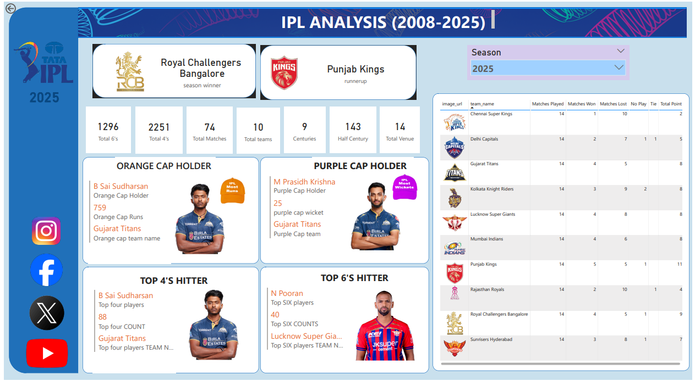

This project presents an end-to-end data analysis of IPL (Indian Premier League) data using Power BI. It covers the full workflow from data cleaning and transformation to building interactive dashboards and extracting meaningful insights.

The goal of this project is to analyze match data, uncover trends, and visualize key performance metrics of teams and players.

